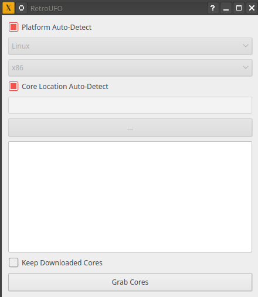
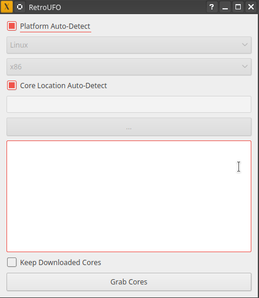
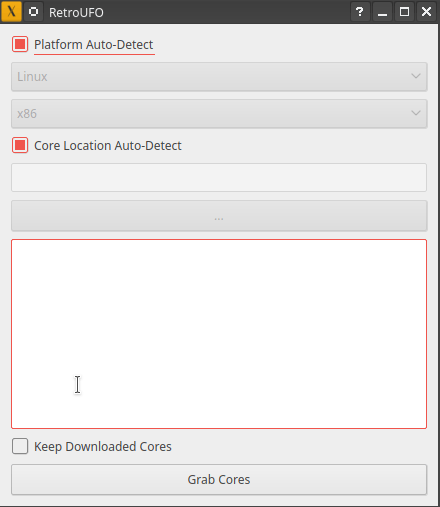

# RetroUFO
[](https://www.youtube.com/watch?v=NLGoKxh8Aq4)
[](https://www.python.org/downloads/) [](https://opensource.org/licenses/MIT)

A ~~messy~~ Python script that grabs the latest version of every libretro core from the [build bot](https://buildbot.libretro.com/).  

***
### Usage-CLI

Just run the script with _Python 3_:

```bash
python3 ./RetroUFO.py
```

It will then download and extract all the latest versions of each core to their default location based on `retroarch.default.cfg` for each platform  
_(Which is only Linux & Windows for right now)_

If you are more of a advance user, and want to do things a bit more manually, you can view all the scripts arguments by:
```bash
python3 ./RetroUFO.py --help
```

### Usage-GUI

The GUI script uses [Qt for Python](https://wiki.qt.io/Qt_for_Python) ([PySide2](https://pypi.org/project/PySide2/)). So you can make sure you have that package installed by running:  
```bash
pip3 install --user PySide2
```
After that you can just run the script like so:
```bash
python3 ./RetroUFO_GUI.py
```

You can then just click the `Grab Cores` button at the bottom and then you should be all set.



If you would like to grab cores for a different platform or architecture you can override which supported cores it grabs.



If you have your core directory set somewhere special you can override where the cores extract to.



***
### TO-DO

- Set where cores are downloaded
- ~~Set where cores are extracted for RA Usage~~
- ~~Choose which architecture you are downloading format~~
- ~~Choose what platform you are downloading format~~
- ~~Auto detect platform & architecture~~
- Download progress bar
- ~~Keep downloaded archives~~
- ~~Make GUI~~
- Real error handling
- Support for ARM detection
